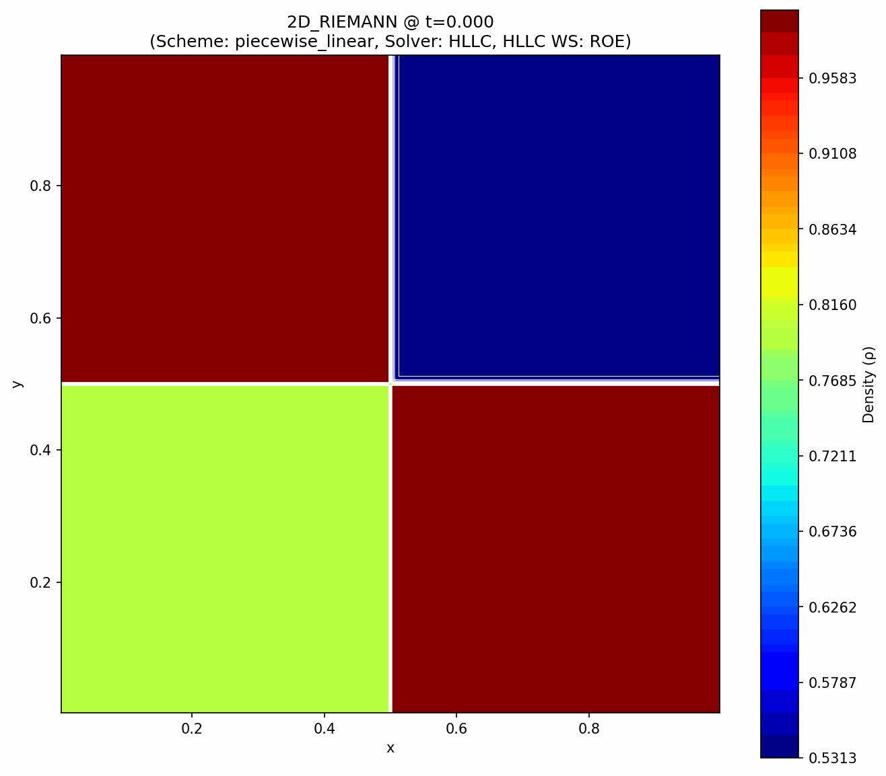

# 2D Euler CFD Benchmarks

> **Disclaimer:** This code was developed for educational purposes to demonstrate the implementation of modern CFD techniques. It is not intended for production use or as a validated, reliable scientific tool.

A 2D, structured-grid, finite volume solver for the compressible Euler equations, written in Python with NumPy. This project focuses on solving classic gas dynamics benchmark problems and serves as a clear, modular example of a modern CFD solver.

## Results Showcase

Here are some results from the implemented benchmark cases.

### Double Mach Reflection (DMR)

This problem simulates a strong shock wave reflecting off a wedge, creating a complex pattern of shocks and a characteristic Mach stem.



### 2D Riemann Problem

This is a classic test case involving the interaction of four different initial states, leading to the formation of shocks, contact discontinuities, and rarefaction waves.


---

## Features

- **2D Euler Equations:** Solves the conservation laws for mass, momentum (x, y), and energy for an inviscid, compressible fluid.
- **Finite Volume Method:** A robust and widely used method for solving conservation laws.
- **Modular Code Structure:** The solver is broken down into logical, easy-to-understand Python modules.
- **Selectable Schemes:**
  - **Spatial Reconstruction:** First-order (`piecewise_constant`) and second-order (`piecewise_linear` with minmod limiter) schemes.
  - **Time Integration:** First-order (`euler`) and second-order (`ssprk2`) Strong Stability Preserving Runge-Kutta methods.
- **Selectable Riemann Solvers:**
  - **HLL:** A simple and robust approximate Riemann solver.
  - **HLLC:** A more accurate solver that correctly resolves contact discontinuities and shear waves.
- **Command-Line Interface:** Easily configure and run different simulations without editing the code.
- **Frame Generation:** Built-in capability to save frames for creating videos and GIFs.

---

## Project Structure

The source code is organized into several modules within the `src/` directory:

| File                     | Description                                                                                             |
| :----------------------- | :------------------------------------------------------------------------------------------------------ |
| `main.py`                | The main entry point. Handles command-line arguments, the time integration loop, and calls other modules. |
| `setups.py`              | Defines the grid and initial conditions for each benchmark problem (`dmr`, `2d_riemann`, `2d_sod`).       |
| `schemes.py`             | Implements the spatial reconstruction and calculates the final right-hand-side (RHS) of the equations.    |
| `riemann_solvers.py`     | Contains the HLL and HLLC approximate Riemann solvers for calculating numerical flux.                     |
| `boundary_conditions.py` | Manages the application of boundary conditions (transmissive, reflective, inflow) to the ghost cells.     |
| `plotting.py`            | Handles all visualization, including showing live plots and saving frames to disk.                        |
| `utils.py`               | Contains core utility functions for converting between primitive and conserved variables.                 |
| `config.py`              | Stores global physical constants like `GAMMA` and the `CFL` number.                                     |
| `make_gif.py`            | A helper script to compile saved frames into an animated GIF.                                           |

---

## How to Run the Solver

You can run any simulation from the command line using `main.py`.

### Basic Command

```bash
python src/main.py --problem [problem_name] [options]
```

### Key Command-Line Arguments

- `--problem`: The benchmark to run. Choices: `dmr`, `2d_riemann`, `2d_sod`. (Default: `dmr`)
- `--scheme`: The spatial reconstruction scheme. Choices: `piecewise_constant`, `piecewise_linear`. (Default: `piecewise_linear`)
- `--solver`: The Riemann solver. Choices: `hll`, `hllc`. (Default: `hllc`)
- `--integrator`: The time integration method. Choices: `euler`, `ssprk2`. (Default: `ssprk2`)

### Example Commands

**Run the Double Mach Reflection problem (default settings):**
```bash
python src/main.py --problem dmr
```

**Run the 2D Riemann problem with the HLL solver:**
```bash
python src/main.py --problem 2d_riemann --solver hll
```

**Run the 2D Sod Shock Tube with a first-order scheme:**
```bash
python src/main.py --problem 2d_sod --scheme piecewise_constant --integrator euler
```

---

## Creating Videos and GIFs

### 1. Generate Frames

First, run a simulation with the `--save_frames` flag. You can also control the time between frames.

```bash
# This will create an 'output_frames' directory and save a frame every 0.001 seconds of simulation time
python src/main.py --problem dmr --save_frames --frame_interval 0.001
```

### 2. Create an MP4 Video

After the frames are generated, navigate into the `src/output_frames/` directory and use this FFmpeg command:

```bash
ffmpeg -framerate 25 -i frame_%04d.png -vf "pad=ceil(iw/2)*2:ceil(ih/2)*2" -c:v libx264 -pix_fmt yuv420p dmr_video.mp4
```

### 3. Create a GIF

Alternatively, from the `src/` directory, run the `make_gif.py` script:

```bash
python make_gif.py
```
This will create a `simulation.gif` file in the `src/` directory.

---

## Testing

The project includes a suite of unit tests using `pytest` to ensure the correctness of the core components. To run the tests, navigate to the project's root directory and run:

```bash
pytest -v
```

---

## GPU Acceleration with CUDA

For higher performance on larger meshes, an alternative version of the solver has been implemented that uses CUDA via the CuPy library, allowing the calculations to be executed on NVIDIA GPUs. This code is located in the `src_gpu/` directory.

The acceleration becomes significant on larger-scale problems, where the massive parallelism of the GPU can be fully leveraged. On smaller meshes, the overhead of data transfer between the CPU and GPU can result in slower runtimes compared to the CPU-based version.

### Performance Example: Double Mach Reflection (DMR)

The table below compares the execution times (in seconds) between the CPU (NumPy) and GPU (CuPy) implementations for the DMR problem at different resolutions.

| Resolution | CPU (s) | GPU (s) |
| :--------- | :------ | :------ |
| 240x60     | 8.90    | 14.71   |
| 420x120    | 77.86   | 31.25   |
| 960x420    | 659.65  | 73.31   |


---

## Documentation

A more detailed document explaining the numerical methods and theory behind the solver will be added to the `/doc` folder as a PDF in the future.

---

## References

These benchmark problems are based on foundational papers in computational fluid dynamics.

- **Double Mach Reflection:**
  > Woodward, Paul, and Phillip Colella. “The Numerical Simulation of Two-Dimensional Fluid Flow with Strong Shocks.” *Journal of Computational Physics* 54, no. 1 (April 1, 1984): 115–73. https://doi.org/10.1016/0021-9991(84)90142-6.

- **2D Riemann Problems:**
  > Lax, Peter D., and Xu-Dong Liu. “Solution of Two-Dimensional Riemann Problems of Gas Dynamics by Positive Schemes.” *SIAM Journal on Scientific Computing* 19, no. 2 (March 1998): 319–40. https://doi.org/10.1137/S1064827595291819.

- **Sod Shock Tube:**
  > Sod, Gary A. “A Survey of Several Finite Difference Methods for Systems of Nonlinear Hyperbolic Conservation Laws.” *Journal of Computational Physics* 27, no. 1 (April 1, 1978): 1–31. https://doi.org/10.1016/0021-9991(78)90023-2.

---

## License

This project is licensed under the **MIT License**. See the `LICENSE` file for details.
